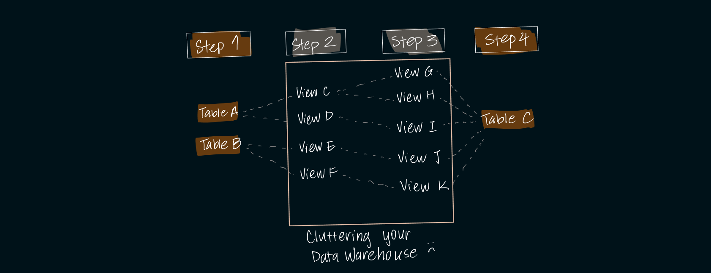
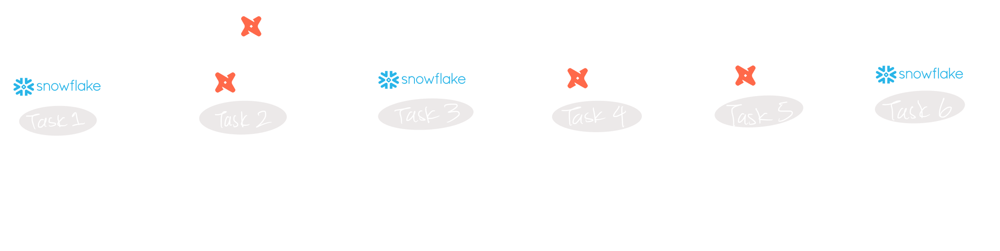

Data transformation has been historically seen as a means to an end. 

It's magically where "data gets cleaned" and "prepared" before being fed into your favorite BI tool.

However, it's one of the most important areas to invest in, especially in the age of AI. 

    

dbt introduced a different approach of bringing software development best practices to data analytics. By allowing for modularity and repeatability of SQL code, dbt infused many analytics teams with guardrails to improve data quality and workflow efficiency. 

dbt is currently the best in-class data transformation tool, companies are starting to notice some key problems that dbt creates and fails to address.

I'll outline them below.

<!-- truncate -->
----
## Limiting Transformation Framework
One dbt model = one data warehouse object (view, table). 

This causes two main problems: 

1. An over-saturation of data warehouse objects that serve no purpose but to act as an intermediary object between Step x and Step y.

    This not only clutters data warehouses with middle views and tables, but it's a computationally expensive framework which can lead to unecessary full-table scans and reloads. 
    
    While breaking down transformations into distinct components is crucial, users should have the flexibility to decide whether intermediate steps manifest as views/tables or are treated as Common Table Expressions (CTEs) or subqueries during compilation. 
    
    This allows for a more streamlined and efficient data transformation process tailored to user preferences and computational needs.

2. dbt restricts developers from executing DML or non-select statements for transformations, constraining the architectural and logical patterns data engineers can use to transform data. 

    Developers often resort to Airflow-orchestrated SQL scripts or stored procedures to fill the gaps in dbt's framework.

    These gaps increase complexity in the pipeline, making upstream data management more difficult. 
    
    They also leave holes in data governance, testing, and documentation. 

    

## Excessive Manual Work
Documentation and testing, while powerful, demand extensive manual effort often unrealistic for smaller teams. As a result, data documentation is incomplete, tests underutilized, and lineage limited to dbt transformations. 

At the end of the day, many data teams end up focusing only on building models, neglecting crucial manual tasks and perpetuating data quality, visibility, and accessibility challenges.

## Steep Learning Curve
dbt requires users at least 6 months for proficiency and an additional 2 years for fluency. To harness dbt's full benefits, users must rebuild everything within its framework, taking another 6 months to 1 year. 

Managers frequently encounter challenges when training their teams on Jinja and navigating dbt's syntactical nuances, which can substantially impede workflow efficiency.

## Computationally Expensive
Many companies using dbt quickly faced soaring Snowflake compute and storage costs. 

dbt's platform, with its inherent full-table scans, lacks crucial insights for query optimization, such as the resulting query plan or warnings for potentially computationally-expensive tasks.

While the modern data stack often leans towards "throwing money at the problem," this approach proves unsustainable. 

Some companies we've engaged with invested over a year rebuilding their dbt models with a different logical framework to address and optimize for prohibitively high Snowflake costs.

## What's Next?
There's much to be desired in the world of data transformation.

As AI + Data comes to the forefront of executives' minds, investing in data transformation will build the foundation of clean, correct, well-modeled data structures. 

It's an absolutely imperative part of any data team's stack.