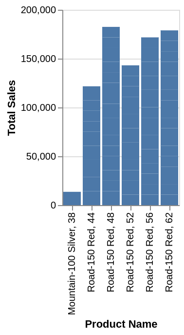
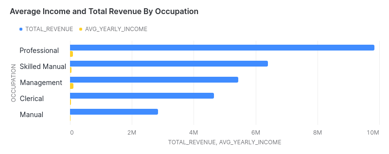
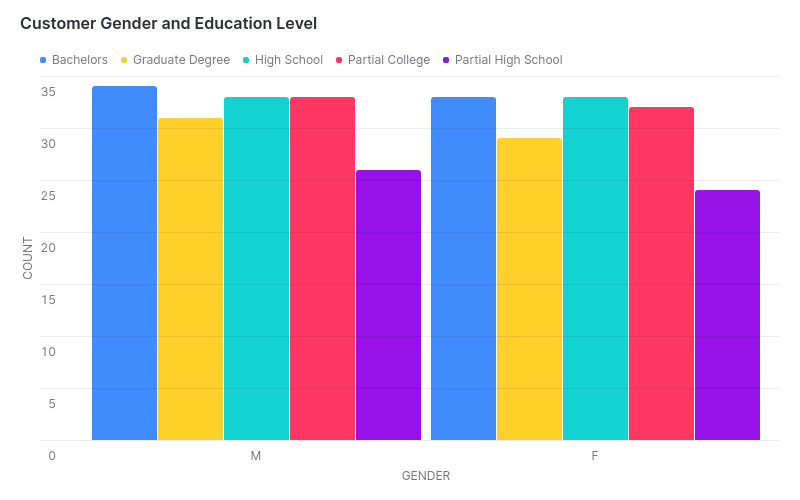

In our experiments at Kater, we’ve uncovered a fundamental challenge: 

LLMs, as they currently stand, struggle with math. And you know what math is critical for? Drumroll, please... data analysis!

<div style={{ display: "flex", justifyContent: "center", padding: "0rem 0 2rem 0" }}>
    
</div>

While LLMs excel in many areas, complex mathematical reasoning over datasets isn’t one of them—yet. 

But don’t worry, it’s not all doom and gloom. Despite these limitations, LLMs can still augment an analyst's workflow in powerful ways, particularly through code generation. This opens new avenues of inquiry and fosters deeper insights, even if the models aren’t math whizzes just yet.

In this post, we’ll explore how LLMs can be leveraged to supercharge data analysis by working alongside analysts, and how future advancements may further close the gap in their mathematical capabilities.

<!-- truncate -->
----
**All the files for the following can be found in our [github repo](https://github.com/kater-ai/data-analysis-experiment).**

**TLDR: While LLMs are currently bad at numerical data analysis, they can be used to hypothesize interesting (non numerical) patterns in the data and their code generation abilities can be leveraged by analysts to explore their datasets**

----
## The Problem

Ok, so lets say you're a business analyst at [AdventureWorks](https://learn.microsoft.com/en-us/sql/samples/adventureworks-install-configure?view=sql-server-ver16&tabs=ssms) and you're trying to get some insight into the following business question:

`Which resellers are the most successful in each sales territory?`

You've used [Kater](https://www.kater.ai/) to get the following SQL for your question:
```sql
SELECT
  dr.RESELLERNAME,
  dst.SALESTERRITORYREGION,
  SUM(frs.SALESAMOUNT) AS TOTAL_SALES
FROM
  KATER.ADVENTUREWORKSDW.FACTRESELLERSALES frs
  LEFT JOIN KATER.ADVENTUREWORKSDW.DIMRESELLER dr ON frs.RESELLERKEY = dr.RESELLERKEY
  LEFT JOIN KATER.ADVENTUREWORKSDW.DIMSALESTERRITORY dst ON frs.SALESTERRITORYKEY = dst.SALESTERRITORYKEY
GROUP BY
  dr.RESELLERNAME,
  dst.SALESTERRITORYREGION
ORDER BY
  TOTAL_SALES DESC
```

Here are the first few rows of what that dataset looks like:

| RESELLERNAME                      | SALESTERRITORYREGION | TOTAL_SALES |
|----------------------------------|----------------------|-------------|
| Brakes and Gears                 | Northwest            | 877115      |
| Excellent Riding Supplies        | Southeast            | 853854      |
| Vigorous Exercise Company        | Canada               | 841917      |
| Totes & Baskets Company          | Southwest            | 816767      |
| Retail Mall                      | Canada               | 799294      |
| Corner Bicycle Supply            | Canada               | 787770      |
| Outdoor Equipment Store          | Northeast            | 746325      |
| Thorough Parts and Repair Services | Northwest            | 740989      |

Awesome, but now you want to analyze this data - where do you start? Well traditionally you would reach for your sql, python, excel or whatever tools you're most comfortable with and start graphing, tweaking, twisting and bopping the data every which way. What if we could leverage LLMs to analyze the data and generate some insights for you?

Well that's exactly what we did, here were some responses from the three models we tested:

Gemini 1.5
1. Highest Sales: "Brakes and Gears" in the Northwest region has the highest total sales at $877,115.
2. Southwest Region: The Southwest region has the most resellers (18) but shows significant variation in individual reseller performance.
3. Strongest Region: Canada has the highest average sales per reseller at approximately $533,324.

Claude 3 Sonnet:
1. The Northwest region has a significant number of resellers with high total sales, indicating a strong market presence in that region.
2. The United Kingdom, France, and Germany have a notable presence in the data, indicating a significant market for bicycle and sporting goods resellers in these European countries.
3. Resellers with names implying a focus on high-end or premium products (e.g., "Elite," "Extraordinary," "Exhilarating") tend to have higher total sales figures.

GPT4 Turbo:
1. Top Sellers: "Brakes and Gears" in the Northwest and "Excellent Riding Supplies" in the Southeast are the top two resellers by total sales, highlighting strong market performance in these regions.
2. Presence of Specialized Services: Some resellers seem to offer specialized services or products (e.g., "Leather Seat Factory," "Odometers and Accessories Company"), indicating a market for specialized bicycle components and accessories.
3. Market Opportunities: The presence of resellers in less traditional sectors (e.g., hotels, health spas) suggests opportunities for expanding the market by targeting lifestyle and leisure sectors, potentially increasing the overall demand for bicycles and related products.

I know what you're thinking: "but Robin, these seem to be perfectly good analyses", or maybe you're not thinking that. Either way, there's a major problem here. Almost every numerical analysis that is not directly citing a figure in the data is absolutely wrong. 

Take this one for instance:
`Southwest Region: The Southwest region has the most resellers (18) but shows significant variation in individual reseller performance.`

There are 57 resellers in the Southwest region in the dataset, not 18.

Here's another claim that's absolutely incorrect:
`Strongest Region: Canada has the highest average sales per reseller at approximately $533,324.`

Although I'm picking on Gemini a little here, in our dataset of questions I can point to examples of all three models making up numbers whenever any sort of math is involved (unless the number is explicitly stated in the dataset).

## In search of a solution

We shouldn't throw out the idea of asking LLMs to analyze datasets altogether though. While some of the responses are a little too generic to be useful (especially if you graph the data), there are some patterns which genuinely could lead to interesting lines of inquiry. For example: 

`Presence of Specialized Services: Some resellers seem to offer specialized services or products (e.g., "Leather Seat Factory," "Odometers and Accessories Company"), indicating a market for specialized bicycle components and accessories.`

Maybe this leads an analyst to look into the specialized bicycle component sales and how the sales from specialty resellers compare to regular resellers.

All this is to say - I think these insights can serve as an interesting jumping off point for analysts looking to explore relationships in their data, **as long as the insights are tightly constrained to avoid mathemagical fiction**. The tricky thing is how to avoid inundating the analyst with patterns which are irrelevant or uninteresting. This is something we're still thinking about. 

## Code to the rescue!

Ok, so we know these models aren't that good at math, but they're multimodal, COMPUTER VISION BABBBYYYYYYYY! Surely if we feed them a graph of the data they can come up with some interesting data points, right? Right? Well, no. Actually the same issues we ran into while attempting to analyze the dataset come back to haunt us. 

I won't [boar](https://www.google.com/search?q=boar&sca_esv=13b8ee85e24d7ba9&tbm=isch&source=iu&ictx=1&vet=1&fir=91YcE1CUzkt0mM%252Cp3MJ32pUJGThnM%252C%252Fm%252F0dr47%253BnF9oquEHKf89DM%252CJ5CWdijhxP1c-M%252C_%253B8FkvPFO6lOYZOM%252Cq2uqOMQ9WgKebM%252C_%253BY_bdMBml2O1-jM%252CLTNWwBCDqkjAOM%252C_%253B5TaN2rQOIFn9uM%252CcGZnG4ijXUDDnM%252C_%253BOdoiijVx5ojJqM%252C7Pr6sVaE2jOb_M%252C_&usg=AI4_-kSwb9amk_eGj3VrbeztsLZyUciMDA&sa=X&ved=2ahUKEwjbicOk9vKEAxVPDzQIHU_4DtgQ_B16BAhZEAE#imgrc=nF9oquEHKf89DM) you with too many of the details, but here's an example graph from another one of our datasets:



And here is the analysis of this png by gpt4

```
Based on the graph you provided, here are three notable trends:

The 'Road-150 Red' product line shows an increasing trend in total sales with increasing product size. Starting from the smallest size '38', each subsequent larger size shows greater total sales, peaking with size '62'.

The 'Mountain-100 Silver, 38' product has significantly lower total sales compared to any of the 'Road-150 Red' sizes. This might suggest a stronger market preference for the 'Road-150 Red' products over the 'Mountain-100 Silver' product, at least within the context of this data.

The two largest sizes of the 'Road-150 Red', sizes '56' and '62', show the highest total sales among all the products listed, indicating that these particular sizes are possibly the most popular or most in-demand within this product category.
```

Points 1 and 3 are incorrect, while point 2 is not particularly interesting. We see this trend cropping up again where LLMs are not the most useful for analysis but are great for summaries of data.

### Given what we know, how do we analyze data using LLMs?

While LLMs are bad at analyzing datasets directly, they're rather good at generating code.

#### Given the following prompt in Claude:
```
You will receive as input the metadata of one snowflake table formatted in the following way:

TABLE METADATA:

<fully qualified table name>; <column>; <column>; <column>...;

Each <column> has the following format: <column name> <column datatype> <(precision, scale)> <NULL>; where precision and scale are optional and NULL is present if the column is nullable.

Given this input, generate snowflake sql queries to find three interesting insights about the dataset.

TABLE METADATA:

REVENUEBYCUSTOMER; EDUCATION TEXT(16777216) NULL; TOTAL_REVENUE NUMBER(38,10) NULL; YEARLYINCOME NUMBER(38,10) NULL; GENDER TEXT(16777216) NULL; OCCUPATION TEXT(16777216) NULL;
```

#### It returned the following snowflake sql queries:
#### 1. Find the total revenue and average yearly income grouped by occupation
```sql
SELECT
    OCCUPATION,
    SUM(TOTAL_REVENUE) AS TOTAL_REVENUE,
    AVG(YEARLYINCOME) AS AVG_YEARLY_INCOME
FROM
    REVENUEBYCUSTOMER
GROUP BY
    OCCUPATION
ORDER BY
    TOTAL_REVENUE DESC;
```


#### 2. Find the distribution of customers by gender and education level
```sql
SELECT
    GENDER,
    EDUCATION,
    COUNT(*) AS CUSTOMER_COUNT
FROM
    REVENUEBYCUSTOMER
GROUP BY
    GENDER,
    EDUCATION
ORDER BY
    CUSTOMER_COUNT DESC;
```



#### 3. Identify customers with high revenue but low yearly income
```sql
SELECT
    OCCUPATION,
    EDUCATION,
    GENDER,
    TOTAL_REVENUE,
    YEARLYINCOME
FROM
    REVENUEBYCUSTOMER
WHERE
    TOTAL_REVENUE > (SELECT AVG(TOTAL_REVENUE) FROM REVENUEBYCUSTOMER)
    AND YEARLYINCOME < (SELECT AVG(YEARLYINCOME) FROM REVENUEBYCUSTOMER)
ORDER BY
    TOTAL_REVENUE DESC;
```

| OCCUPATION       | EDUCATION       | GENDER | TOTAL_REVENUE | YEARLYINCOME |
|------------------|-----------------|--------|---------------|--------------|
| Professional     | Bachelors       | F      | 764269        | 70000        |
| Professional     | Bachelors       | M      | 643981        | 70000        |
| Skilled Manual   | Partial College | F      | 572100        | 60000        |
| Professional     | Bachelors       | F      | 531197        | 60000        |
| Clerical         | Partial College | M      | 495712        | 40000        |
| Clerical         | Partial College | M      | 489375        | 30000        |
| Skilled Manual   | Partial College | M      | 485113        | 60000        |
| Clerical         | Partial College | F      | 460513        | 40000        |
| Clerical         | Bachelors       | M      | 431501        | 30000        |


### Drilling Down Further
We can even drill down on one of the above queries and generate further insights from just that query:
```
You will receive as input the metadata of one snowflake table formatted in the following way:

TABLE METADATA:

<fully qualified table name>; <column>; <column>; <column>...;

Each <column> has the following format: <column name> <column datatype> <(precision, scale)> <NULL>; where precision and scale are optional and NULL is present if the column is nullable.

Given this input, and a query which identifies customers with high revenue but low yearly income. Generate snowflake sql queries to drill down into the original query and find three interesting insights about the dataset.

TABLE METADATA:

REVENUEBYCUSTOMER; EDUCATION TEXT(16777216) NULL; TOTAL_REVENUE NUMBER(38,10) NULL; YEARLYINCOME NUMBER(38,10) NULL; GENDER TEXT(16777216) NULL; OCCUPATION TEXT(16777216) NULL;

Query: 
SELECT OCCUPATION, EDUCATION, GENDER, TOTAL_REVENUE, YEARLYINCOME
FROM
REVENUEBYCUSTOMER
WHERE
TOTAL_REVENUE > (SELECT AVG(TOTAL_REVENUE) FROM REVENUEBYCUSTOMER)
AND YEARLYINCOME < (SELECT AVG(YEARLYINCOME) FROM REVENUEBYCUSTOMER)
ORDER BY
TOTAL_REVENUE DESC;
```

And the response:
#### 1. Find the top 5 occupations with the highest average revenue for customers with low yearly income
```sql
SELECT
  OCCUPATION,
  AVG(TOTAL_REVENUE) AS AVG_REVENUE
FROM
  REVENUEBYCUSTOMER
WHERE
  YEARLYINCOME < (SELECT AVG(YEARLYINCOME) FROM REVENUEBYCUSTOMER)
GROUP BY
  OCCUPATION
ORDER BY
  AVG_REVENUE DESC
LIMIT 5;
```

#### 2. Find the education levels with the highest percentage of customers having low yearly income but high revenue
```sql
WITH cte AS (
  SELECT
    EDUCATION,
    COUNT(*) AS total_count,
    SUM(CASE WHEN TOTAL_REVENUE > (SELECT AVG(TOTAL_REVENUE) FROM REVENUEBYCUSTOMER) AND YEARLYINCOME < (SELECT AVG(YEARLYINCOME) FROM REVENUEBYCUSTOMER) THEN 1 ELSE 0 END) AS high_revenue_low_income_count
  FROM
    REVENUEBYCUSTOMER
  GROUP BY
    EDUCATION
)
SELECT
  EDUCATION,
  ROUND(100.0 * high_revenue_low_income_count / total_count, 2) AS percentage
FROM
  cte
ORDER BY
  percentage DESC;
```

#### 3. Find the top 10 combinations of education and occupation with the highest average revenue for customers with low yearly income
```sql
SELECT
  EDUCATION,
  OCCUPATION,
  AVG(TOTAL_REVENUE) AS AVG_REVENUE
FROM
  REVENUEBYCUSTOMER
WHERE
  YEARLYINCOME < (SELECT AVG(YEARLYINCOME) FROM REVENUEBYCUSTOMER)
GROUP BY
  EDUCATION,
  OCCUPATION
ORDER BY
  AVG_REVENUE DESC
LIMIT 10;
```

## Wrapping up

Welp, that's about it for me folks. Hope you got something of value from this post.
In summary: data analysts aren't going away any time soon, at least not until LLMs greatly improve their 
mathematical reasoning skills. However that doesn't mean we can't use LLMs to make the lives of analysts 
significantly easier and open new avenues of exploration for them.
These are the kind of things we're thinking about at Kater

Until next time, be kind to yourselves,
Robin
