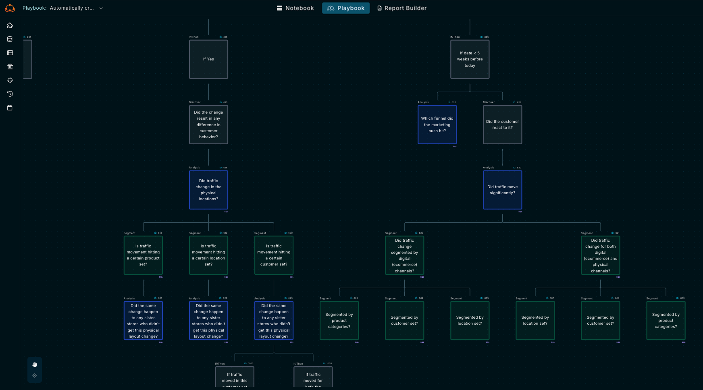

# Get Started with Kater.ai

## What is Kater? 

Kater is the first **data playbook builder** that enables your data team to define **actionable steps based on data outcomes**, bridging the gap between data analysis and decision-making. Kater combines a unified data model with the flexibility of SQL to dynamically generate personalized reports and guide your team's next moves.

As your team answers data questions through playbooks, Kater automatically builds a shared **data model** which serves as the source of truth for your business metrics and semantics. This data model is version-controlled and follows SWE best practices.

The data model enables business experts to ask personalized follow-up questions from the playbooks using plain English. Give anyone the power to answer and unblock their personal data requests.

:::info[Our Mission]
To transform your data into profit by accelerating the problem-to-impact workflow and enabling a proactive, decision-driven analytics culture, replacing the outdated reactive approach.
:::

Kater sits in the middle of your data stack, supplementing your BI tool to provide deeper and more flexible analytics.

    

Using a complex mesh of multi-modal agents, Generative AI and Retrieval AI, Kater allows data experts to rapidly build and iterate **Playbooks** using plain English. 

Business users can then utilize Butler, their AI agent, to ask questions about the **Playbooks**, and receive personalized answers to support their individual needs.

Build at the speed of thought, extract actionable insights, and turn your stakeholders into analytics leads. 

---
## Quickstart
:::info[Get Set Up In 30 Minutes]
1. [Connect your data warehouse](./category/connect) (2 min)
2. [Set Up A Persona](./personas/) (2 min)
3. [Define Joins in Data Map](./data-map/set_up) (5 min)
4. [Build a Playbook](./playbooks/) (20 min)
:::

## How it works
### Data Playbooks

**Decision trees are the most natural and effective way to brainstorm solutions to complex business problems.** 

Kater lets you brainstorm a flow using plain English, rapidly transform it into SQL, capture the necessary decisions to make, and use the flow to generate reports dynamically.

:::warning[The Problem with the Current Landscape]
Static dashboards don't provide the flexibility and interoperability to address the majority of stakeholder needs. Companies don't know what to focus on for the week and don't receive actionable insights.
:::

:::tip[The Solution]
**Decision trees** of questions that each represents SQL. Built by the data team, version controlled, utilized and improved by business users. Also known as-- **Playbooks**. 
:::

In every analyst’s head, there’s a complex web of decision-tree structures that guide them to know 
1. what data exists,
2. which hypotheses to validate, 
3. how to write the SQL to obtain the data.

That's exactly what `Playbooks` are built to capture.

* **For Data Teams:** 
    * You can build a `Playbook` which outlines a decision tree of questions for individual personas, used to automatically generate reports, insights, and stories.
    * Each node represents one SQL query, which can be stored as a `view` in your data warehouse. This is version controlled so you can manage changes over time and follow SWE best practices.
* **For Business Users:** 
    * `Playbooks` act as guardrails for which questions to ask and hypotheses to verify based on your objective. 
    * You can ask questions about the report generated by the `Playbook` just like how you'd ask a data team member. Butler will personalize answers for you.

---

### Knowledge sources
Kater connects to various sources to obtain the necessary context required to support Playbook building and SQL generation. 

    

Kater currently connects with 
* most data warehouses ([Snowflake](./connect/Snowflake), [BigQuery](./connect/BigQuery), [Redshift](./connect/Redshift), [Databricks](./connect/Snowflake))
* [dbt Cloud](./connect/integrations/dbt)
* [Slack](./connect/integrations/slack)
* [GitHub](./connect/integrations/github)

:::info
Most of Kater's immediate info comes directly from your data warehouse's metadata upon connection. Kater infers your join keys and semantic relationships between your tables to generate a Data Map.
:::

## Why Now?
We're a team of former data engineers and analysts at Microsoft, Kaiser Permanente, Crexi, and Abbott, who have committed our lives to solving the complex problem of data accessibility and data literacy across organizations.

:::tip[One Problem Is Clear]
Through hundreds of discovery interviews with seasoned data professionals and our personal experiences, one problem stood out the greatest:

**An astronomically wide knowledge gap exists between the data team and domain experts.**
:::

    

### Define & Track Decisions from Data
Traditional Business Intelligence (BI) platforms tell you what’s happening, but not what questions to ask, or how to interpret the data to drive actions.

As a result, data teams are often inundated with adhoc requests from decision makers because they're unable to obtain the data they need to make a decision.

When decisions are made, they aren't defined and tracked.

Companies are left blind to how they used data in the past to made decisions, and how they can use the same data to make decisions moving forward. 

Kater provides the platform to map exactly this.

### Turn Data Into Profit Centers 
Problem --> Data --> Business Question(s) --> Insight --> Action --> $$$ Impact

The solution is simple: 
1. Define the correct business questions to ask based on an objective.
2. The questions lead to insights. 
3. Based on the insights, define what actions to take. 
4. See how those actions impact your bottom line.

Ready to get started? [Connect your data warehouse.](./category/connect)