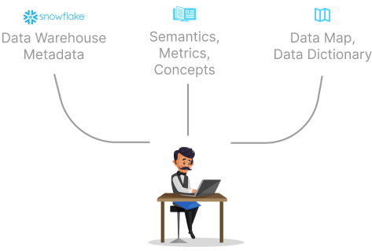

# Welcome Katerers!

## What is Kater? 

Kater is a platform which allows you to query your company's internal data using plain English.

Using a combination of Large Language Models (LLMs) and Retrieval Augmented Generation (RAG), Kater combines the strength of both Generative AI and Retrieval AI to continuously learn about the intricacies of your data estate. 

The more you use Kater, the better it gets.

## Meet Butler 

Butler is your data agent. 

### The Junior Intern
Just like your data team onboards a new data analyst, Butler starts off as a junior intern with limited knowledge about your database. Over time, he grows and learns the nuances of your semantic layer, metrics, business objectives, and intricacies of your data warehouse. 

Through a continuous feedback loop of learning, Butler has the potential to become a data steward who guides your company towards data-driven decision making.

In these docs, you'll learn how to best onboard Butler to your company's data estate.

## Quickstart
1. [Connect your data warehouse](./category/connect) (2 min)
2. [Review the auto-generated Data Map](./onboard-butler/data_map) (5 min)
2. [Add questions to the Query Bank](./onboard-butler/query_bank) (5 min)
3. [(Optional) Set up Personas, Concepts, Metrics, & Semantics](./onboard-butler/concepts) (15 min)
4. Start asking questions!

## How it works
### Knowledge sources
Butler connects to various sources to obtain the necessary context required to answer data questions accurately. 

Currently, most of Butler's immediate info comes directly from you data warehouse's metadata upon connection. Butler infers your join keys and semantic relationships between your tables to generate a Data Map. 

Additional info comes from your global semantic layer, metrics, concepts, and data dictionary. This additional context gets programatically passed into Butler's context depending on the question you ask.

In the future we plan to integrate with your entire modern data stack-- data governance tools like Alation, transformation tools like dbt, business intelligence tools like Tableau, and admin tools like Jira/Slack. This will provide a more holistic and automatic method of obtaining auxiliary business context for your company's data.

### Self-training
As you use Butler, the more context he generates about your data estate, the better he gets at answering data questions.

 

This is done through Retrieval Augmented Generation (RAG), which programmatically injects similar previously validated question + SQL combinations as additional context for Butler to better answer the current question. 

With built-in feedback mechanisms, Butler learns from your corrections and validations to improve his answers over time. 

## Why Kater?
We're a team of seasoned data engineers and analysts solving the problem of data accessibility and data literacy across organizations.

### The Data Revolution
Prior to Generative AI, stakeholders accessed data through channels like Jira, Slack, and your Business Intelligence (BI) platform. 

The problems with this existing workflow are:

* Jira and Slack as "data service" options are inherently unscalable and time-consuming for both parties. 

* Business Intelligence (BI) platforms like Tableau provide a very narrow view into your database, limiting the scope of questions and answers someone can obtain.  

Kater doesn't replace these options; rather, it functions as the glue in your data stack, serving as a stable, self-learning, and optimized data agent. 

It integrates with your existing infrastructure, offering insights and support in areas where the data team may be constrained by time or resources.

### Look, a data team member! It's a unicorn!
Data has largely become a rare comodity due to the limited channels in which stakeholders can access the data team. 

### Life without Butler
 

### Life with Butler
 

While stakeholders can start retrieving answers to their questions faster, data teams are simultaneously relieved of pressure to respond to urgent adhoc requests.

We aim to make Kater a fun, interactive, curiosity-driven platform which encourages its users to utilize data on a daily basis, from open-ended discovery and exploration, to detailed white-paper analyses.

Ready to get started? [Connect your data warehouse.](./category/connect)