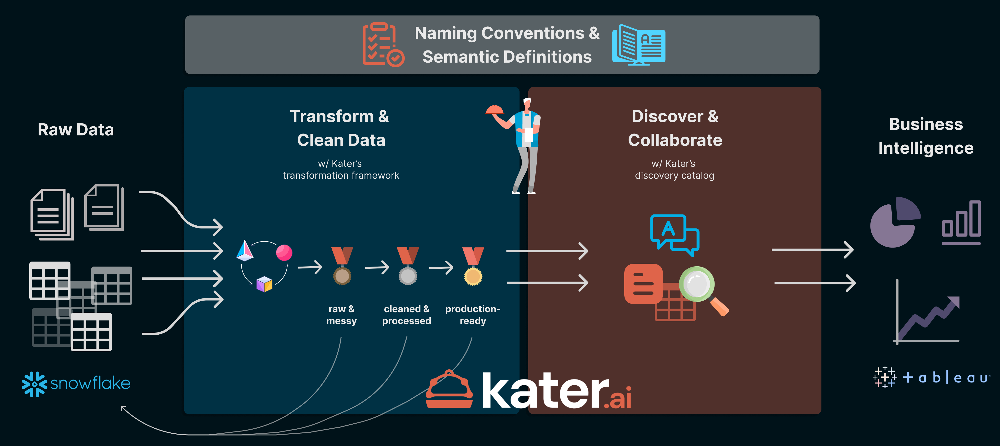
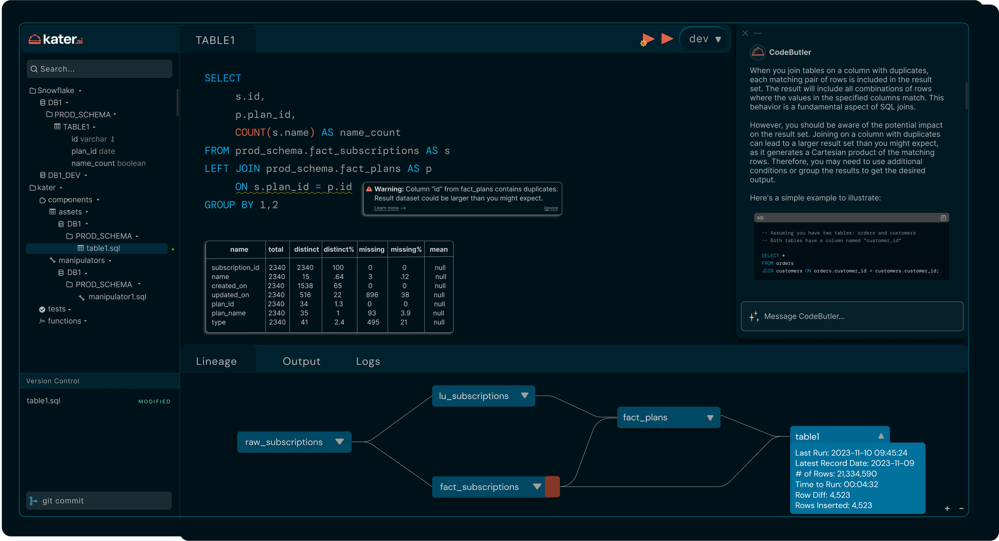
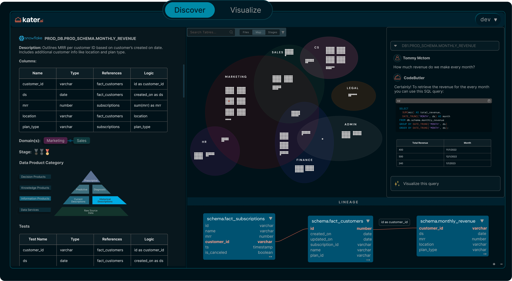
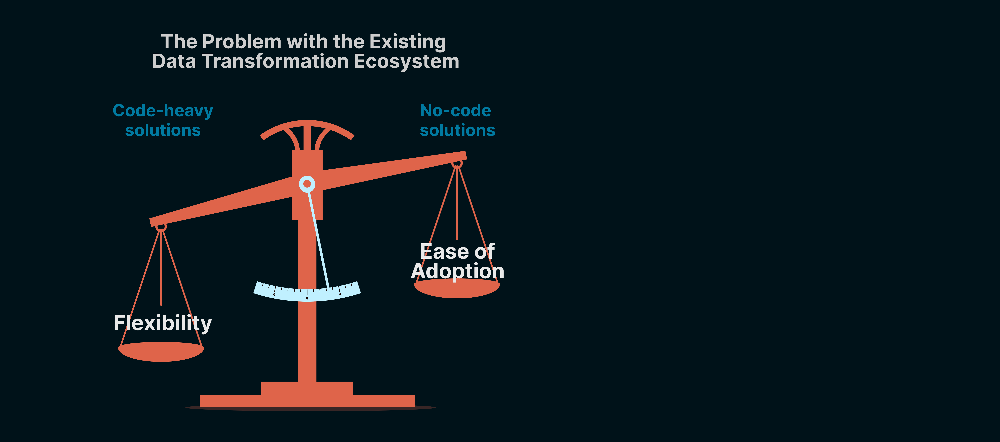
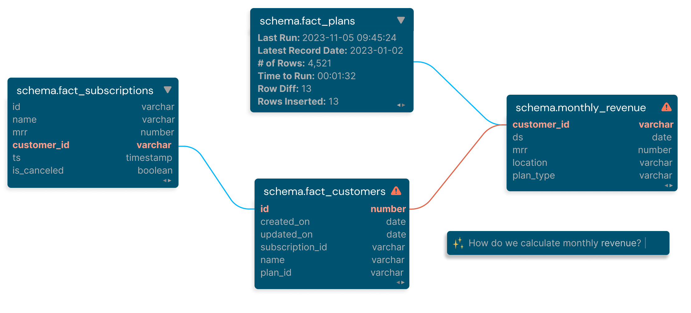

# Welcome Katerers!

We're on a quest to help you build your first AI data analyst and AI data engineer. Imagine a world where everyone in your company can use your data to power any business decision they make. Your data is discoverable. It's trustworthy. It's understandable. That's our goal. 

How do we reach that goal? Kater integrates data transformation and discovery for both developers and data consumers, eliminating the traditional separation between data transformation and business intelligence.

In a nutshell-- developers create robust data transformations with greater flexibility than dbt. End-users can access resulting data products without requiring SQL knowledge.

## <FontAwesomeIcon icon="fa-sharp fa-toolbox" /> Kater for Developers
Our tailored Integrated Development Environment (IDE) not only automates the most laborious tasks for you using AI, but also empowers you to swiftly construct intricate data transformations using SQL, all while adhering to the highest standards of software development. 

We took our favorite parts of existing IDEs like Jupyter, VS Code, DataGrip, and DBeaver, and combined them into one IDE. Then we infused every process with AI to simplify and automate your workflow.

Build data pipelines with our powerful transformation framework in Kater ComponentsBeta. It's built to be more flexible than dbt, and the best part- you don't need to know jinja. 

## <FontAwesomeIcon icon="fa-solid fa-users-viewfinder" /> Kater for Stakeholders

Discover your data in a fun, interactive environment. The Kater DiscoveryBeta tab is like your company's Pokedex. Query, visualize, and interact with your company's data without knowing any SQL. Answer your data questions in a couple clicks. Now, **you** own the data, and **you** decide what type of data you want moving forward by collaborating with your data team. 

## <FontAwesomeIcon icon="fa-solid fa-list-check" /> Core terminology

* **Project:** each project contains one type of data warehouse or data store.
* **Connection:** each project can have multiple connections to distinguish between different working environments and access permissions (dev, prod, stg, etc).
* **Katerer:** every user is a Katerer. Katerers can share access to multiple projects, can share connections per project, and can have their own individual connections.
* **Asset:** represents a tabular object in your data warehouse (table, view). These populate as nodes in the Augmented Lineage.
* **Manipulator:** represents DML code which alters an existing data asset (update, insert, copy into, etc). These populate as badges on nodes in the Augmented Lineage.
* **Component:** a block of code which either produces an asset or a manipulator.
* **Contract:** a YAML file attached to each data asset which acts as a data contract to validate data quality & schema.
* **Augmented Lineage:** a graph that tracks how data flows through each component, their associated data contracts, and other info about each asset.
* **Data Domain:** the business function(s) which the data asset is part of.

## <FontAwesomeIcon icon="fa-solid fa-plug-circle-check" /> How it works in a nutshell
* Kater automatically manages, tracks, and versions all your existing warehouse tables. You can also specify which tables you want to track. *Note: None of your metadata or data is stored in our application database. All data is stored locally on your browser's cache.*
* Every component is a versioned standalone SQL file.
* Each file either builds a data asset (table/view), or manipulates an existing data asset (DML queries).
* Kater's transformation framework is more powerful and flexible than dbt's.
* In your component, specify only the `schema.table`. Kater dynamically builds the object based on the connected database, allowing seamless development in the dev environment and effortless deployment in the main branch for production.
* Data validation is written into each component as a data contract. The contract's skeleton is automatically generated by CodeButler, but requires you to fill out the remainder.
* All transformations, metadata, column-level lineage, and documentation acts as fuel to power your new AI data analyst, which only gets smarter the more you build. 

## <FontAwesomeIcon icon="fa-solid fa-seedling" /> What you'll need

- [A Snowflake account](https://signup.snowflake.com/?utm_source=google&utm_medium=paidsearch&utm_campaign=na-us-en-brand-cloud-phrase&utm_content=go-rsa-evg-ss-free-trial&utm_term=c-g-snowflake%20computing-p&_bt=586482091419&_bk=snowflake%20computing&_bm=p&_bn=g&_bg=136172942788&gclsrc=aw.ds&gad_source=1&gclid=Cj0KCQiAyKurBhD5ARIsALamXaF5PvuBn1ChhOFeSQhSNqINhxl-FmEYhllOuQUSScowNM-FToBsVbcaArmPEALw_wcB) with raw data that you want to transform.

## <FontAwesomeIcon icon="fa-solid fa-bell-concierge" /> Why Kater?
Data is the new oil. We're forging a future where data connects every business decision you make, by seamlessly integrating data transformation logic into your business intelligence. 

With existing tools, business intelligence is a separate entity from data transformation. Software development best practices are not built into data transformation platforms, leading to unscalable, unwieldly pipelines. 

Why should you sacrifice flexibility & scalability for adoption ease? Why make any sacrifices at all?

**With Kater, your technical developers will still have the flexibility to build specifically to your company's needs, without boxing them into pre-built no-code solutions.**

We simply empower your already talented group of developers and business leaders to build a data ecosystem that follows software development best practices, and build an enterprise-ready, mature data estate.

## <FontAwesomeIcon icon="fa-solid fa-handshake-angle" /> How Kater helps you
### 1. Automate tedious work
CodeButler streamlines data pipeline development by automating documentation, suggesting tests, and aiding in code debugging for your data warehouse. It accelerates workflows, saving hours of manual and repetitive tasks, ultimately improving data quality and visibility. 

With intuitive prompts, CodeButler assists in tasks like defining primary keys, suggesting schemas, troubleshooting errors, proposing tests, listing tables, and generating documentation, enhancing productivity for data professionals.

### 2. Complete data visibility 
Kater addresses data governance challenges by providing built-in column-level lineage and summarized logs. This facilitates tracking of transformation steps, error identification, and enhances data accessibility. Kater's Discovery Catalog enables stakeholders to interact with the data, promoting cross-functional access and empowering teams for comprehensive data visibility.

**Data accessibility is the key to reaching that final level of data maturity.** It isn't until people from different functions of your business start accessing your data, that your company can truly make data-driven decisions.

### 3. Katered data contracts 
Validating your data at every step has never been easier. We help you apply unit tests, column-level tests, and table-level tests to every transformation step. 

And when things inevitably go wrong, it's easy to add additional validation to ensure they never go wrong again.

### 4. In-line SQL editor support
Kater's editor offers real-time intelligent suggestions and warnings based on metadata, reducing debugging time. It provides live profiling, aggregation, and tracking of each table's data for comprehensive insights into your data.

## <FontAwesomeIcon icon="fa-solid fa-trowel-bricks" /> Let's start building!

Kater specializes in the "T" in "ELT", which means ideally you already have most of your raw data in your data warehouse. 

The following steps will help you quickly start realizing Kater to its full potential. 

1. Sign up for the [waitlist](https://www.kater.ai/waitlist) to obtain full access to the Kater Web UI. This is completely free-- no credit card required.
2. Set up roles and permissions for your data warehouse objects.
3. Add connections to your data warehouse on Kater's Connect portal.
4. Connect your Github repository.
5. Explore Kater's pre-loaded folders and objects so you can start building components.
6. Migrate your existing transformation scripts into Kater. 
7. You're ready to start building! See the Components documentation to learn how to build your first transformation.
