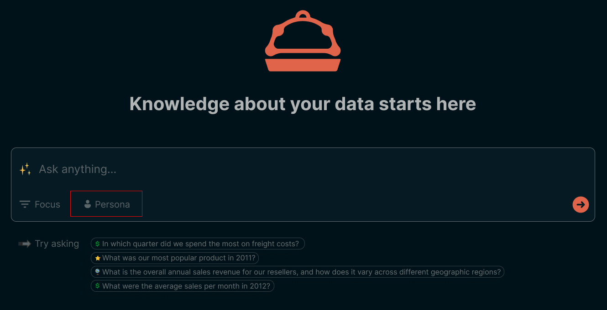

# Personas
:::info
A `Persona` is a representation of a team member with a specific set of business questions, metrics, and data sources that they care about.

This helps Butler tailor his data sources and responses to the business requirements of the `Persona`.
:::

## Onboarding a data analyst

Think about it like this: if you were to onboard a new data analyst today, what business vertical would you assign them to learn about and become the resident expert in? 

* Would you assign them to the **Sales team**, where they would learn about the sales process, the sales funnel, and the sales metrics? 

* Would you assign them to understand the **newest product feature** your company is launching, and the metrics that are important to track for that feature?

* Or would you assign them as part of your **Market Expansion Project** to understand the new markets you are entering, and the metrics that are important to track for that project?

## Personas can be specific or general

`Personas` can represent different projects, product verticals, business domains, or any combination of the above. 

It organizes the chaos of data into a structure that mirrors the priorities and requirements of your organization.

:::note 
We are purposely keeping it free-form for you to decide what is the best organizational method for your company's data.
:::

## When a Persona matters

`Personas` are chosen when a person interacts with Butler in the chat. 

:::tip
This influences
1. The tables we pass into Butler for additional context
2. The semantics and additional context we provide for Butler
3. The responses Butler provides to the user
:::