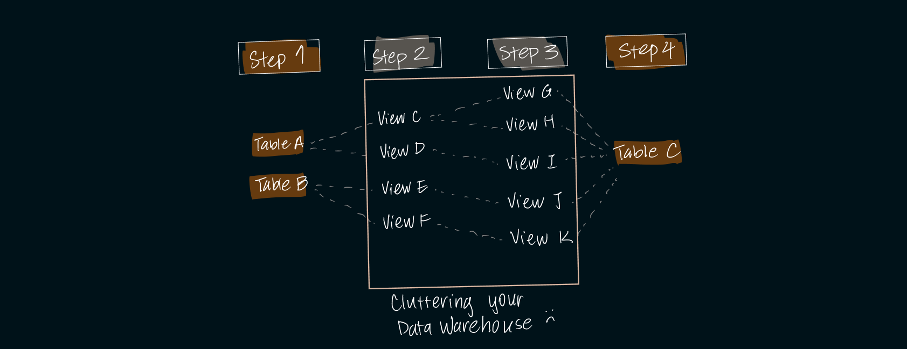
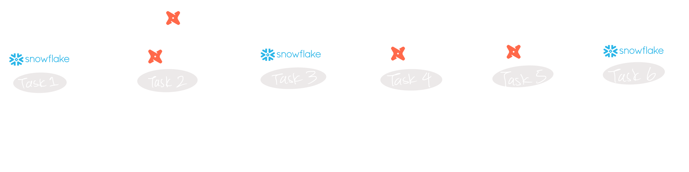

dbt introduced a different approach of bringing software development best practices to data analytics. By allowing for modularity and repeatability of SQL code, dbt infused many analytics teams with guardrails to improve data quality and workflow efficiency. 

We're here to discuss some pitfalls of using dbt. 

Although it is currently the best in-class data transformation tool, companies are starting to notice some key problems that dbt creates and fails to address. Kater's platform addresses these.

## Limiting Transformation Framework
One dbt model = one data warehouse object (view, table). 

This causes two main problems: 

1. An over-saturation of data warehouse objects that serve no purpose but to act as an intermediary object between Step x and Step y.

    This not only clutters data warehouses with middle views and tables, but it's a computationally expensive framework which can lead to unecessary full-table scans and reloads. 
    
    Breaking down each transformation into separate components is certainly important, but **users should have the flexibility to choose whether intermediate steps appear as views/tables or are treated as CTEs or subqueries during compilation**.

2. dbt restricts developers from executing DML or non-select statements for transformations, constraining their approach. Developers often resort to Airflow-orchestrated SQL scripts or stored procedures to fill the gaps in dbt's framework.

    These gaps increase complexity in the pipeline, making upstream data management more difficult. They also leave holes in data governance, testing, and documentation. 

    

    

## Excessive Manual Work
dbt has a steep learning curve with its project setup and jinja language requirements. The average dbt user requires at least 6 months of continuous building with dbt to reach proficiency. 

Furthermore, the 