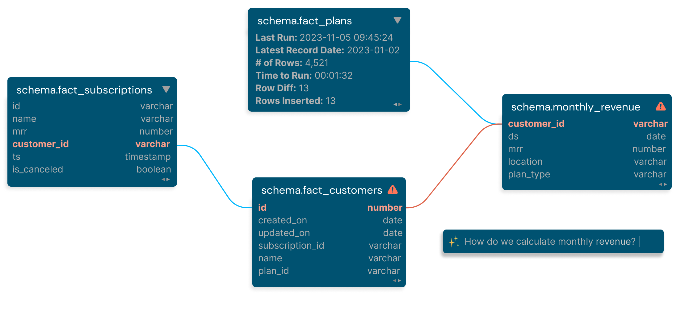

# Welcome Katerers!

Join us in learning about Kater's [AI-powered data transformation platform](https://www.kater.ai) so your data team can rapidly build, test, and document production-ready, mature data pipelines at a fraction of the monetary and operational cost-- all while following software engineering best practices.

We care about helping your team build quality data products that are usable and visible across your entire organization. 

## <FontAwesomeIcon icon="fa-sharp fa-toolbox" /> Built by data engineers for data teams
Kater was born from a desire to use cutting edge LLM technology to reimagine what’s possible in a data transformation platform, promising a future where writing tedious boilerplate SQL is no longer needed, data validation and data contracts are automatically written into each transformation step for maximum quality assurance, and column-level data is tracked from source to sink.

## <FontAwesomeIcon icon="fa-solid fa-list-check" /> Core terminology
Let's review some vocabulary, shall we?

* **Project:** each project contains one type of data warehouse or data store.
* **Connection:** each project can have multiple connections to distinguish between different working environments and access permissions (dev, prod, stg, etc).
* **Katerer:** every user is a Katerer. Katerers can share access to multiple projects, can share connections per project, and can have their own individual connections.
* **Asset:** represents a tabular object in your data warehouse (table, view). These populate as nodes in the Augmented Lineage.
* **Manipulator:** represents DML code which alters an existing data asset (update, insert, copy into, etc). These populate as badges on nodes in the Augmented Lineage.
* **Component:** a block of code which either produces an asset or a manipulator.
* **Contract:** a YAML file attached to each data asset which acts as a data contract to validate data quality & schema.
* **Augmented Lineage:** a graph that tracks how data flows through each component, their associated data contracts, and other info about each asset.
* **Data Domain:** the business function(s) which the data asset is part of.

## <FontAwesomeIcon icon="fa-solid fa-plug-circle-check" /> How it works in a nutshell
* Kater automatically manages, tracks, and versions all your existing warehouse objects. You can also specify which assets you want to track. 
* None of your metadata or data is stored in our application database. All data is stored locally on your browser's cache.
* Every component is a versioned standalone SQL file.
* Each file either builds a data asset (table/view), or manipulates an existing data asset (DML queries).
* Build assets with only `SELECT` statements. No boilerplate SQL required.
* In your component, you only specify the `schema.table`, and depending on which database you're connected to when you run the component, Kater builds the object with that `database.schema.table`. This makes it easy to develop in your `dev` environment, then swap to the `main branch` to run your component in `prod`.
* Data validation is written into each component as a data contract. The contract's skeleton is automatically generated by CodeButler, but requires you to fill out the remainder.
* You can choose to execute your component on a Spark cluster or against your data warehouse.
* Jinja is supported but not required.

## <FontAwesomeIcon icon="fa-solid fa-seedling" /> What you'll need

- [A Snowflake account](https://signup.snowflake.com/?utm_source=google&utm_medium=paidsearch&utm_campaign=na-us-en-brand-cloud-phrase&utm_content=go-rsa-evg-ss-free-trial&utm_term=c-g-snowflake%20computing-p&_bt=586482091419&_bk=snowflake%20computing&_bm=p&_bn=g&_bg=136172942788&gclsrc=aw.ds&gad_source=1&gclid=Cj0KCQiAyKurBhD5ARIsALamXaF5PvuBn1ChhOFeSQhSNqINhxl-FmEYhllOuQUSScowNM-FToBsVbcaArmPEALw_wcB) with raw data that you want to transform.

## <FontAwesomeIcon icon="fa-solid fa-bell-concierge" /> Why Kater?

The problem with the current landscape of transformation platforms is they either 
* offer flexibility at the expense of operational ease, 
* or they’re no-code solutions which offer operational ease at the expense of flexibility & scalability. 

Kater is the bridge to this gap.

**With Kater, your technical developers will still have the flexibility to build specifically to your company's needs, without boxing them into pre-built no-code solutions.**

We simply empower your already talented group of developers and business leaders to build a data ecosystem that follows software development best practices, and build an enterprise-ready, mature data estate.

## <FontAwesomeIcon icon="fa-solid fa-handshake-angle" /> How Kater helps you
### 1. Automate tedious work <FontAwesomeIcon icon="fa-solid fa-wand-sparkles" />
Data professionals like you want to build high-quality, unit-tested, well-documented, scalable data pipelines. With existing transformation tools, these tasks are manual, repetitive, and sometimes impossible. As a result, building mature data pipelines turns out to be an extremely arduous process with a lot of operational overhead. Data quality suffers, data visibility suffers, and you suffer. 

CodeButler is intelligently programmed to connect to your data warehouse and seamlessly helps you generate documentation, suggest tests, and debug your code, shaving **hours** off your workflow.

Some example prompts you can ask CodeButler: 
* `What column(s) should the primary key for this table be?`
* `I have this set of tables that I want to model into a fact table. Can you suggest a schema?`
* `What's wrong with my code? I'm receiving this error: <...>`
* `Suggest a test for this table to ensure that <problem> doesn't happen again.`
* `List out all my marketing tables.`
* `Generate documentation for FACT_USERS.`

...and so much more.

We're excited to see what creative ways you utilize CodeButler.

### 2. Complete data visibility <FontAwesomeIcon icon="fa-solid fa-glasses" />
Data governance is notoriously one of our biggest challenges as data professionals. Kater's built-in column-level lineage and summarized logs makes it easier to track transformation steps, identify errors, and makes your data much more accessible. 

Kater also documents and tracks non-Kater-created data assets in your warehouse. Stakeholders can now interact with your data catalog via CodeButler and interface with your data like never before.

**Data accessibility is the key to reaching that final level of data maturity.** It isn't until people from different functions of your business start accessing your data, that your company can truly make data-driven decisions. Kater's augmented lineage and catalog supercharges your team to ultimate data visibility.

### 3. Katered data contracts <FontAwesomeIcon icon="fa-solid fa-file-circle-check" />
Validating your data at every step has never been easier. 

We help you apply unit tests, column-level tests, and table-level tests to every transformation step. The responsibility for data quality should fall on everyone-- developers and stakeholders, which is why we make it easy to collaborate on building a data contract per transformation, so everyone knows exactly what to expect. 

And when things inevitably go wrong, it's easy to add additional validation to ensure they never go wrong again.

### 4. In-line SQL editor support <FontAwesomeIcon icon="fa-solid fa-terminal" />
Kater's editor provides intelligent suggestions and warnings based on your metadata. This happens live, as you code, to reduce downstream errors that could cost hours of debugging. Each table's data is profiled, aggregated, and tracked so you can receive data about your data in ways you never thought you needed before. 

## <FontAwesomeIcon icon="fa-solid fa-trowel-bricks" /> Let's start building!

Kater specializes in the "T" in "ELT", which means ideally you already have most of your raw data in your data warehouse. 

The following steps will help you quickly start realizing Kater to its full potential. 

1. Sign up for the [waitlist](https://www.kater.ai/waitlist) to obtain full access to the Kater Web UI. This is completely free-- no credit card required.
2. Set up roles and permissions for your data warehouse objects.
3. Add connections to your data warehouse on Kater's Connect portal.
4. Connect your Github repository.
5. Explore Kater's pre-loaded folders and objects so you can start building components.
6. Migrate your existing transformation scripts into Kater. 
7. You're ready to start building! See the Components documentation to learn how to build your first transformation.
